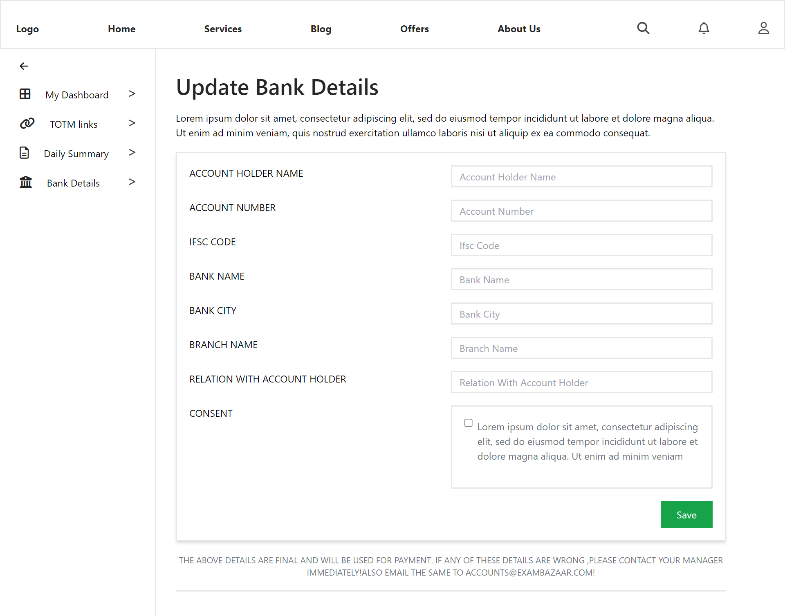
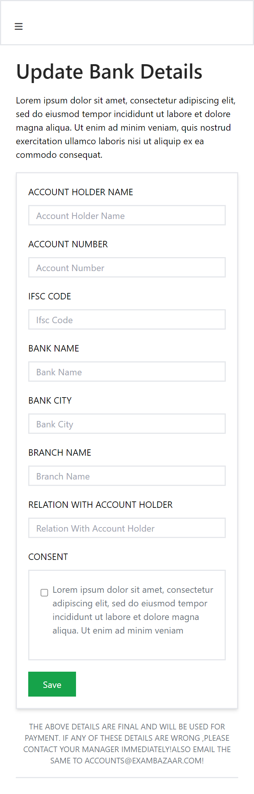

# **Exambazaar project**

This is my project for Exambazaar as an assignment. This project is a replica of the figma design provided by the exambazaar.

## **Technology Used**

1. ReactJS
2. Tailwind CSS

> ReactJS is used as a frontend library, and Tailwind CSS for styling in this project

## **Steps followed to setup the project**

1. ### **Step 1**

   Created a folder named **exambazaar**

2. ### **Step 2**

   Open my folder in **VS Code**, then used yarn to create the react app by using the following command in terminal-

   ```
    yarn create react-app .
   ```

3. ### **Step 3**

   After creating the react app, I had setup the tailwind CSS installation after creating the react app by using the following command-

   ```
    yarn add tailwindcss
   ```

## **Project output**




